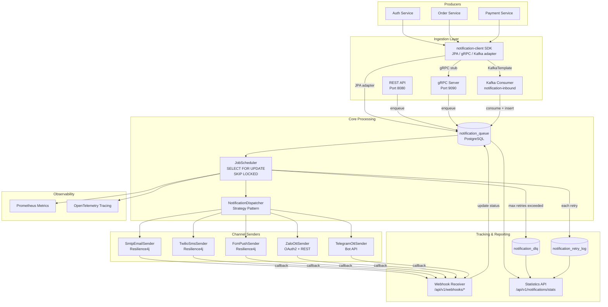
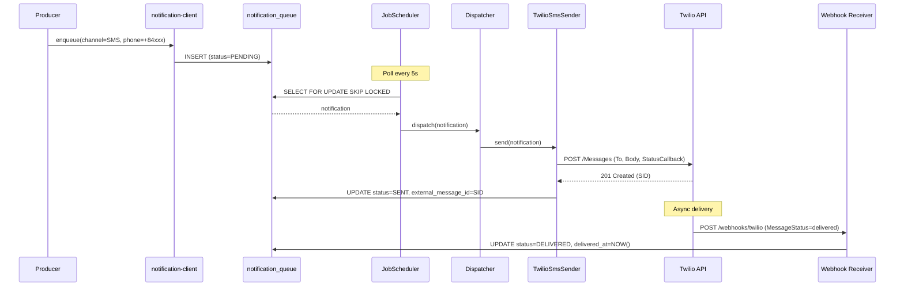
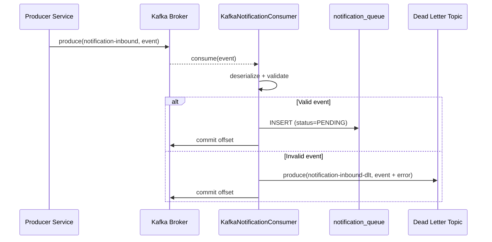
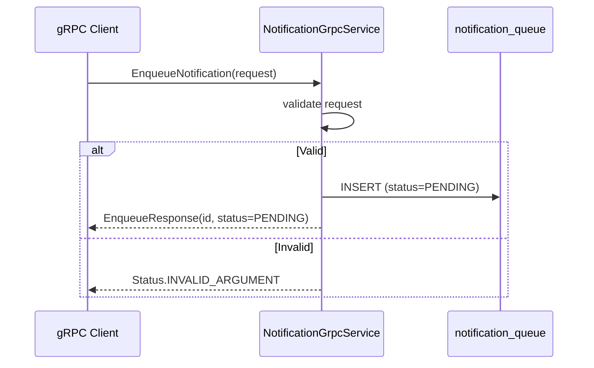

# Technical Specification — Notification Service Phase 2

## 1. Architecture Overview



## 2. Data Schema (ERD)

### 2.1 notification_queue (ALTER — add columns)

```sql
-- V4__add_sub_channel_and_tracking.sql
ALTER TABLE notification_queue ADD COLUMN IF NOT EXISTS sub_channel VARCHAR(20);
ALTER TABLE notification_queue ADD COLUMN IF NOT EXISTS device_token TEXT;
ALTER TABLE notification_queue ADD COLUMN IF NOT EXISTS phone_number VARCHAR(20);
ALTER TABLE notification_queue ADD COLUMN IF NOT EXISTS external_message_id VARCHAR(255);
ALTER TABLE notification_queue ADD COLUMN IF NOT EXISTS delivered_at TIMESTAMPTZ;
ALTER TABLE notification_queue ADD COLUMN IF NOT EXISTS read_at TIMESTAMPTZ;
ALTER TABLE notification_queue ADD COLUMN IF NOT EXISTS delivery_channel_response JSONB;

CREATE INDEX idx_nq_sub_channel ON notification_queue(sub_channel);
CREATE INDEX idx_nq_external_message_id ON notification_queue(external_message_id);
CREATE INDEX idx_nq_status_channel ON notification_queue(status, channel);
```

### 2.2 notification_dlq (NEW)

```sql
-- V5__create_notification_dlq.sql
CREATE TABLE notification_dlq (
    id               BIGSERIAL PRIMARY KEY,
    notification_id  BIGINT NOT NULL REFERENCES notification_queue(id),
    channel          VARCHAR(10) NOT NULL,
    error_code       VARCHAR(50),
    error_message    TEXT,
    last_retry_at    TIMESTAMPTZ,
    retry_count      INT NOT NULL DEFAULT 0,
    resolved         BOOLEAN NOT NULL DEFAULT FALSE,
    resolved_at      TIMESTAMPTZ,
    resolved_by      VARCHAR(100),
    created_at       TIMESTAMPTZ NOT NULL DEFAULT NOW()
);

CREATE INDEX idx_dlq_resolved ON notification_dlq(resolved);
CREATE INDEX idx_dlq_channel ON notification_dlq(channel);
```

### 2.3 notification_retry_log (NEW)

```sql
-- V6__create_notification_retry_log.sql
CREATE TABLE notification_retry_log (
    id               BIGSERIAL PRIMARY KEY,
    notification_id  BIGINT NOT NULL REFERENCES notification_queue(id),
    attempt_number   INT NOT NULL,
    channel          VARCHAR(10) NOT NULL,
    error_code       VARCHAR(50),
    error_message    TEXT,
    attempted_at     TIMESTAMPTZ NOT NULL DEFAULT NOW()
);

CREATE INDEX idx_retry_log_notification ON notification_retry_log(notification_id);
CREATE INDEX idx_retry_log_attempted ON notification_retry_log(attempted_at);
```

### 2.4 notification_device_token (NEW — for Push)

```sql
-- V7__create_device_tokens.sql
CREATE TABLE notification_device_token (
    id               BIGSERIAL PRIMARY KEY,
    user_id          BIGINT NOT NULL,
    device_token     TEXT NOT NULL,
    platform         VARCHAR(10) NOT NULL, -- IOS, ANDROID, WEB
    app_version      VARCHAR(20),
    active           BOOLEAN NOT NULL DEFAULT TRUE,
    created_at       TIMESTAMPTZ NOT NULL DEFAULT NOW(),
    updated_at       TIMESTAMPTZ NOT NULL DEFAULT NOW(),
    CONSTRAINT uq_device_token UNIQUE(device_token)
);

CREATE INDEX idx_dt_user_id ON notification_device_token(user_id);
CREATE INDEX idx_dt_active ON notification_device_token(active);
```

## 3. Sequence Diagrams

### 3.1 SMS Notification Flow



### 3.2 Kafka Ingestion Flow



### 3.3 gRPC Notification Flow



## 4. API Specification

### 4.1 New REST Endpoints

| Method | Path | Description |
|--------|------|-------------|
| POST | `/api/v1/webhooks/twilio` | Twilio SMS delivery callback |
| POST | `/api/v1/webhooks/zalo` | Zalo OA event callback |
| POST | `/api/v1/webhooks/telegram` | Telegram bot update webhook |
| GET | `/api/v1/notifications/stats` | Delivery statistics (query params: from, to, channel) |
| GET | `/api/v1/notifications/stats/channels` | Per-channel breakdown |
| GET | `/api/v1/notifications/retry-report` | Failed notifications report |
| GET | `/api/v1/notifications/dlq` | Dead letter queue entries |
| POST | `/api/v1/notifications/dlq/{id}/retry` | Manual retry DLQ entry |
| POST | `/api/v1/notifications/dlq/{id}/discard` | Discard DLQ entry |

### 4.2 gRPC Service Definition

```protobuf
syntax = "proto3";
package ntt.notification.v1;

service NotificationService {
    rpc Enqueue(EnqueueRequest) returns (EnqueueResponse);
    rpc BatchEnqueue(BatchEnqueueRequest) returns (BatchEnqueueResponse);
    rpc GetStatus(GetStatusRequest) returns (GetStatusResponse);
    rpc Revoke(RevokeRequest) returns (RevokeResponse);
}

message EnqueueRequest {
    string recipient = 1;
    string template_code = 2;
    string channel = 3;          // EMAIL, SMS, PUSH, OTT
    string sub_channel = 4;      // ZALO, TELEGRAM (when channel=OTT)
    string priority = 5;         // LOW, NORMAL, HIGH, URGENT
    string source_service = 6;
    int64 created_by = 7;
    map<string, string> template_data = 8;
}

message EnqueueResponse {
    int64 notification_id = 1;
    string status = 2;
}
```

### 4.3 Kafka Topic Schema

```json
{
  "topic": "notification-inbound",
  "key": "source_service:source_id",
  "value": {
    "recipient": "string",
    "templateCode": "string",
    "channel": "EMAIL|SMS|PUSH|OTT",
    "subChannel": "ZALO|TELEGRAM",
    "priority": "NORMAL",
    "sourceService": "string",
    "sourceId": "string",
    "createdBy": 0,
    "templateData": {}
  }
}
```

## 5. New Dependencies

```kotlin
// build.gradle.kts additions
// SMS — Twilio
implementation("com.twilio.sdk:twilio:10.6.3")

// Push — Firebase Admin SDK
implementation("com.google.firebase:firebase-admin:9.3.0")

// gRPC
implementation("net.devh:grpc-server-spring-boot-starter:3.1.0.RELEASE")
implementation("io.grpc:grpc-protobuf:1.68.0")
implementation("io.grpc:grpc-stub:1.68.0")

// Kafka
implementation("org.springframework.kafka:spring-kafka")

// OTT — REST clients (Zalo, Telegram use WebClient)
implementation("org.springframework.boot:spring-boot-starter-webflux") // WebClient for OTT APIs
```

## 6. Configuration Properties (New)

```yaml
app:
  notification:
    channels:
      sms:
        enabled: true
        provider: twilio  # twilio | vonage
      push:
        enabled: true
        provider: fcm
      ott:
        enabled: true
    sms:
      twilio:
        account-sid: ${TWILIO_ACCOUNT_SID}
        auth-token: ${TWILIO_AUTH_TOKEN}
        from-number: ${TWILIO_FROM_NUMBER}
    push:
      fcm:
        credentials-file: classpath:firebase-service-account.json
    ott:
      zalo:
        app-id: ${ZALO_APP_ID}
        secret-key: ${ZALO_SECRET_KEY}
        oa-id: ${ZALO_OA_ID}
      telegram:
        bot-token: ${TELEGRAM_BOT_TOKEN}

spring:
  kafka:
    bootstrap-servers: ${KAFKA_BOOTSTRAP_SERVERS:localhost:9092}
    consumer:
      group-id: notification-service-group
      auto-offset-reset: earliest
      key-deserializer: org.apache.kafka.common.serialization.StringDeserializer
      value-deserializer: org.springframework.kafka.support.serializer.JsonDeserializer

grpc:
  server:
    port: 9090
```

## 7. Implementation Phases

### Phase 2a (Sprint 1-2): SMS + Transports
- `TwilioSmsSender` implementing `NotificationSender`
- `TwilioSmsProperties` config
- `KafkaNotificationConsumer` + DLT handling
- `NotificationGrpcService` + .proto file
- `notification-client` v2: add gRPC + Kafka adapters
- Flyway V4-V6 migrations

### Phase 2b (Sprint 3): Push + Tracking
- `FcmPushSender` implementing `NotificationSender`
- `FirebaseConfig` + service account
- `notification_device_token` table + CRUD API
- Webhook receivers (Twilio, Zalo callbacks)
- Delivery tracking status updates

### Phase 2c (Sprint 4): OTT + Read Receipts
- `ZaloOttSender` + OAuth2 token management
- `TelegramOttSender` + bot webhook
- Read receipt tracking (Zalo native, Telegram inline button)
- `sub_channel` routing logic in dispatcher

### Phase 2d (Sprint 5): Reporting + Retry Management
- Statistics API endpoints
- DLQ management (view, retry, discard)
- `notification_retry_log` tracking
- Prometheus custom metrics
- Grafana dashboard templates
